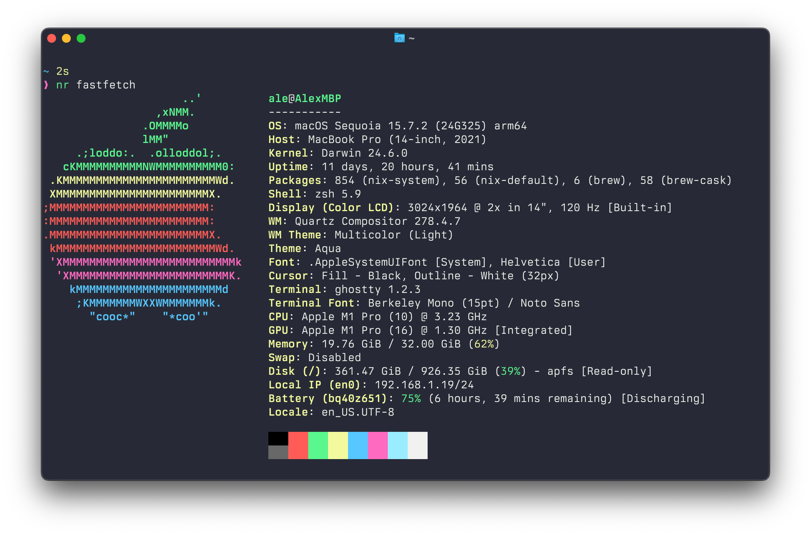

# dotfiles

My [nix-darwin](https://github.com/nix-darwin/nix-darwin) / NixOS configuration. Works on Apple Silicon.

The daily driver is macOS, a NixOS homelab setup is in the works, and NixOS VM setups are recently added for experiments.



## Overview

* [Nix](https://nixos.org/) enables reproducible builds.
* On macOS, [nix-darwin](https://github.com/LnL7/nix-darwin) sets up the system configuration.
* [home-manager](https://github.com/nix-community/home-manager) manages most of the user environment, including Homebrew packages.

## Highlights

* [Ghostty](https://ghostty.org/) as the terminal emulator of choice
* On macOS, [it sets](home/libs/wallpaper.nix) a beautiful wallpaper from [Raycast](https://www.raycast.com/wallpapers)
* Shell configuration:
  * Zsh with a customized [Pure prompt](https://starship.rs/presets/pure-preset#pure-preset) using [Starship](https://starship.rs)
  * A number of handy [aliases](home/programs/zsh.nix) and [functions](home/files/shell/functions.zsh)
  * [Automatic](home/files/shell/proxy.zsh) shell proxy propagation from macOS settings
  * Some shell integrations:
    * [Atuin](https://github.com/atuinsh/atuin) for interactive shell history search
    * [fzf shell integration](home/programs/fzf.nix)
      * CTRL-T - Paste the path of selected files and directories onto the command-line
      * ALT-C - cd into the selected directory
    * [fzf-tab](https://github.com/Aloxaf/fzf-tab) for fuzzy-searching zsh completion results, including a [smart preview window](home/files/shell/fzf.zsh)
    * [lazygit](https://github.com/jesseduffield/lazygit) ([a quick starter video](https://www.youtube.com/watch?v=CPLdltN7wgE))
    * [nix-index-database](https://github.com/nix-community/nix-index-database) to locate the Nix package of a command, and [comma](https://github.com/nix-community/comma) to run the command without installing it.

## Custom Shell Shortcuts & Functions

### Keybindings

Custom Zsh keybindings are configured in [`home/files/shell/keys.zsh`](home/files/shell/keys.zsh).

This is designed to work with default Ghostty macOS keybindings, or the iTerm2 Natural Text Editing keymappings preset.

| Key Combo | Description |
|-----------|-------------|
| `Ctrl+U` | Delete everything to the left of the cursor |
| `Ctrl+X` then `Delete` | Delete entire line to the left of cursor |
| `Ctrl+B` | Jump to beginning of line |
| `Alt+Q` | Push aside current command line to type a new one (re-inserted on next prompt) |
| `Ctrl+X` then `Ctrl+_` | Redo last undone edit |
| `Ctrl+X` then `Ctrl+E` | Edit current command line in `$EDITOR` |
| `Alt+V` | Show next key combo's terminal code and description |
| `Alt+Shift+S` | Prefix current/previous command with `sudo` |

### Custom Functions

Shell functions are defined in [`home/files/shell/functions.zsh`](home/files/shell/functions.zsh).

A non-exhaustive list:

<details>
<summary>Video & Media</summary>

- `burnsrt <input.mp4> <input.srt> <output.mp4>` - Burn SRT subtitles into MP4 video
- `shrinkvid <input> <output> [bitrate]` - Compress video (uses hardware acceleration on macOS)
- `impaste > file.png` - Output clipboard image data to stdout
- `favicon <input.png>` - Generate multi-size favicon.ico from an image
- `dirtypdf <input.pdf> <output.pdf>` - Apply scanner effect to a PDF

</details>

<details>
<summary>Development & Git</summary>

- `gg <repo-url>` - Clone repo and cd into it
- `aic` - Generate AI-powered conventional commit message from staged changes
- `e [file]` - Edit file with `$VISUAL`, or open current directory if no argument
- `s <pattern>` - Search in files with fzf preview using bat

</details>

<details>
<summary>Directory & File Management</summary>

- `take <dir>` - Create directory and cd into it (equivalent to `mkdir -p && cd`)
- `tt` - Create and cd into a temporary directory
- `cdls <dir>` - Change to directory and list its contents
- `decrypt_pdfs <password>` - Decrypt all PDFs in current directory

</details>

<details>
<summary>Network & Diagnostics</summary>

- `t <host>` - Traceroute with [Trippy](https://trippy.rs/) (auto-updates GeoIP database)
- `tu <host>` - UDP traceroute with Trippy
- `https <domain> [port]` - Show TLS certificate details (default port: 443)
- `ttfb <url>` - Measure Time To First Byte with curl
- `listening [pattern]` - List all processes listening on TCP ports
- `pingu <host>` - Ping until success or cancelled
- `lip <ip>` - Lookup IP address details
- `dns <domain>` - Lookup IP address of domain's A record

</details>

<details>
<summary>Nix Utilities</summary>

- `nix-pkgdir <package>` - Get the Nix store path for a package
- `nr <package> [args...]` - Run a package from nixpkgs-unstable without installing
- `ns <pkg1> [pkg2...]` - Start a shell with packages from nixpkgs-unstable

</details>

## Usage Instructions

<details>

<summary>Commonly used commands baked into justfile</summary>

```shell
# Switch darwin configuration
just switch

# Updates all flake inputs
just update

# Updates one flake input
just update-input <flake-input-name>

# For more, run `just` to get all receipes.
```

</details>

<details>

<summary>Installation instructions on a new macOS machine without Nix installed</summary>

Note:

1. Full Disk Access need to be granted for the Terminal app of choice (Ghostty), otherwise [some options will fail](https://github.com/nix-darwin/nix-darwin/issues/1049#issuecomment-2323300537)
2. I currently use macOS Sequoia 15.7.2.

```shell
xcode-select --install

# Clone the dotfiles
mkdir $HOME/.config
git clone https://github.com/birkhofflee/dotfiles $HOME/.config/dotfiles

# Install nix
# @see https://github.com/nix-darwin/nix-darwin/issues/1588
curl --proto '=https' --tlsv1.2 -sSf -L https://artifacts.nixos.org/experimental-installer | \
  sh -s -- install --no-confirm

# Source the nix daemon so that the nix command is available immediately
. /nix/var/nix/profiles/default/etc/profile.d/nix-daemon.sh

# Add trusted users so the substituters work (faster initial build)
sudo sh -c 'echo "trusted-users = ale" >> /etc/nix/nix.custom.conf'
sudo launchctl kickstart -k system/org.nixos.nix-daemon

# Temporarily mitigate 'too many open files' issue
# @see https://github.com/NixOS/nix/issues/6557
ulimit -n 4096

# Build first instead of switching so nix-darwin doesn't complain about our nix settings above
nix run nixpkgs#nh -- darwin build $HOME/.config/dotfiles --hostname AlexMBP --accept-flake-config

# Remove the custom settings so we can activate using nix-darwin
sudo mv /etc/nix/nix.custom.conf{,.before-nix-darwin}

# Activate the configuration
nix run nixpkgs#nh -- darwin switch $HOME/.config/dotfiles --hostname AlexMBP --accept-flake-config
```

</details>

<details>

<summary>NixOS Homelab provisioning instructions</summary>

[nixos-anywhere](https://github.com/nix-community/nixos-anywhere/) is used to remotely setup NixOS host. The machine to provision should be running Linux with kexec support, or simply a minimal NixOS installer.

[nixos-facter](https://github.com/nix-community/nixos-facter) is used in conjunction to dynamically determine configurations from hardware.

```shell
# CAUTION: This IMMEDIATELY erases target host, repartitions it, installs NixOS
# and applies this flake configuration.
nix run github:nix-community/nixos-anywhere -- \
  --generate-hardware-config nixos-facter ./hosts/homelab-nuc/facter.json \
  --flake .#homelab-nuc \
  --target-host root@<machine-ip> \
  --build-on remote
```

To apply new flake config, use the just receipe:

```shell
just switch-homelab
```

</details>

<details>

<summary>NixOS VM bootstrap instructions on macOS (VMware Fusion)</summary>

During my test, it appears that NAT DHCP in VMWare Fusion 13.6.4 doesn't work; use 13.6.3 instead (on macOS Sequoia 15.6.1).

Note that a desktop environment is yet to be properly implemented.

My personal settings are hardcoded in the [justfile](https://github.com/BirkhoffLee/dotfiles/blob/2ddd6e468fa073f8aa5a2d49c0063afda89522eb/justfiles/vm-vmware-fusion.just), you should inspect and modify accordingly, otherwise it is going to fail. After that, proceed to follow the instructions on configuring VMWare Fusion, which can be found in [this YouTube video by Mitchell](https://youtu.be/ubDMLoWz76U?si=pgso1-k7lUuGzAEg&t=86).

After setting the root password, execute the following to bootstrap the VM automatically:

```shell
# This will run `./vm-installer.sh`, that erases the disk, makes partitions on it, configures Nix for the next step.
$ just vm-bootstrap0 <vm-ipv4-address>

# Ensure the VM reboots into the disk instead of the installer.
# After that, run this to initiate the flake switch:
$ just vm-bootstrap <vm-ipv4-address>

# When it finishes, you will be able to SSH into the machine:
$ just vm-ssh [user]
```

</details>

<details>

<summary>NixOS VM bootstrap instructions on macOS (OrbStack)</summary>

Note that there's no GUI support on OrbStack Linux VMs. This setup focuses on usage only via SSH. It's fairly simple to setup on OrbStack compared to doing that on VMWare Fusion. This dotfiles intends to use the default system configurations provided by OrbStack, since it's heavily customized to be used with macOS shell.

```shell
# Ensure OrbStack is running, and create the VM:
$ just orb-create

# After that, simply run this to bootstrap it:
$ just orb-configure
```

</details>

<details>

<summary>Repairing the Nix setup on macOS after a major update from Apple</summary>

> The following steps were applicable to installations with upstream Nix installations.
> It is unknown whether they are needed to follow for a Determinate Systems installation.

1. Upgrade Xcode CLI tools
2. Uninstall nix: https://nix.dev/manual/nix/2.18/installation/uninstall.html#macos
3. A system restart may be required
4. Review [CHANGELOG](https://github.com/LnL7/nix-darwin/blob/master/CHANGELOG) of nix-darwin

```shell
# Install nix
bash <(curl -L https://nixos.org/nix/install) --daemon --yes --no-modify-profile

# Propagate /run
printf 'run\tprivate/var/run\n' | sudo tee -a /etc/synthetic.conf
/System/Library/Filesystems/apfs.fs/Contents/Resources/apfs.util -t

# Fix certs (the uninstallation of nix breaks a symbolic link)
# https://github.com/NixOS/nix/issues/2899#issuecomment-1669501326
# https://discourse.nixos.org/t/ssl-ca-cert-error-on-macos/31171/1
sudo rm /etc/ssl/certs/ca-certificates.crt
sudo ln -s /nix/var/nix/profiles/default/etc/ssl/certs/ca-bundle.crt /etc/ssl/certs/ca-certificates.crt

nix build "$HOME/.config/dotfiles#darwinConfigurations.AlexMBP.system" --extra-experimental-features "nix-command flakes"

sudo ./result/sw/bin/darwin-rebuild switch --flake "$HOME/.config/dotfiles#AlexMBP"
```

</details>

## Other Notes

* Development Environments [should be managed using nix-shell](https://joshblais.com/blog/nixos-is-the-endgame-of-distrohopping/#development-environments).
* [Supercharge](https://sindresorhus.com/supercharge) has to be downloaded manually due to licensing constraints.
* While I'd like Nix to handle every app on my Mac, most GUI apps are better managed by Homebrew due to the conflicting nature of Nix and the self-updating capabilities of those apps.

## TODOs

* File completion
  * List directories first like [this](https://github.com/Aloxaf/fzf-tab/pull/518)
  * When completing with fzf-tab, there's the slash in file names which i dont like
* env check https://github.com/marlonrichert/zsh-launchpad/blob/main/.config/zsh/rc.d/04-env.zsh
* Use [XDG Base Directory Specification](https://specifications.freedesktop.org/basedir-spec/basedir-spec-latest.html) to ensure consistency across different platforms
* check https://github.com/zhaofengli/nix-homebrew

## Articles

Here are some reads you might find interesting:

* [Faster and enjoyable ZSH (maybe)](https://htr3n.github.io/2018/07/faster-zsh/)
* [Comparison of ZSH frameworks and plugin managers](https://gist.github.com/laggardkernel/4a4c4986ccdcaf47b91e8227f9868ded)
* [fzf examples (fzf wiki)](https://github.com/junegunn/fzf/wiki/examples)

Some other dotfiles worth looking into:

* https://github.com/malob/nixpkgs
* https://github.com/ahmedelgabri/dotfiles
* https://github.com/kornicameister/dotfiles/
* https://github.com/Aloxaf/dotfiles/tree/master/zsh/.config/zsh
* https://github.com/paulmillr/dotfiles

Some completions setups:

* https://github.com/mashehu/dotfiles/blob/236af8d7d71989f9755a6ea29ee66e33cbbce1f8/zshrc#L89-L105
* https://github.com/finnurtorfa/zsh/blob/master/completion.zsh

## Acknowledgements

This project was heavily inspired by other open-source dotfiles. A non-exhaustive list:

* https://github.com/mitchellh/nixos-config

Credits are given in the source code where applicable.

## License

This project is released under the [MIT License](LICENSE).
